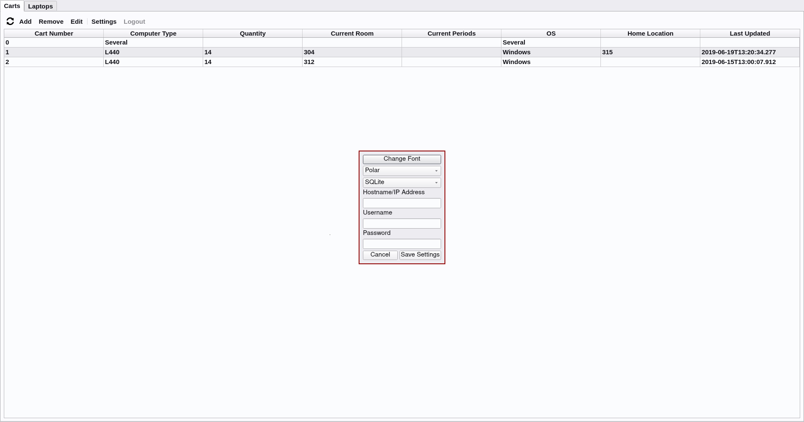

# Computer-Carts
A Qt5 based project created to manage the laptop inventory and laptop carts at the
Columbia Secondary School.

***Note***: The original python/kivy version has been deprecated in favor of this C++/Qt version.

## Build/Install Instructions (Linux)
1. Install Qt build dependencies
2. Change into the ComputerCartQT directory
3. Run `qmake` to create Makefile for your computers architecture
4. Run `make -j $(nproc)`
5. ./ComputerCartQT

### Arch
```bash
sudo pacman -S qt5-base qt5-tools
git clone https://github.com/kevrocks67/Computer-Carts.git
cd Computer-Carts/ComputerCartQT
qmake && make -j$(nproc)
./ComputerCartQT
```

### Ubuntu
```bash
sudo apt install git qt5-default qt5-qmake libqt5sql5-mysql g++ make
git clone https://github.com/kevrocks67/Computer-Carts.git
cd Computer-Carts/ComputerCartQT
qmake && make -j$(nproc)
./ComputerCartQT
```

### CentOS/Fedora
```bash
sudo yum install qt5-qtbase qt5-qtbase-common qt5-qtbase-devel qt5-qtbase-gui \
qt5-qtbase-mysql git make gcc-c++
git clone https://github.com/kevrocks67/Computer-Carts.git
cd Computer-Carts/ComputerCartQT
qmake-qt5 && make -j$(nproc)
./ComputerCartQT
```

## Setting up to use SQL (Linux)
1. Install mariadb/mysql and start the mysql service
2. Enter the mysql commandline interpreter
3. Create a database called ComputerCarts
```
CREATE DATABASE ComputerCarts;
```
4. Open the newly created database
```
USE ComputerCarts;
```
5. Copy/paste the provided schema **(carts.sql)** into the interpreter to create the necessary
    tables
6. Create a user account you can use with the app for database ComputerCarts
```
CREATE USER 'SomeUsername' IDENTIFIED BY 'SomeSecurePassword';
GRANT USAGE ON ComputerCarts.* TO 'SomeUsername'@'%' IDENTIFIED BY 'SomeSecurePassword';
GRANT SELECT, UPDATE, INSERT, DELETE ON ComputerCarts TO 'SomeUsername'@'%';
GRANT SELECT, UPDATE, INSERT, DELETE ON Laptops TO 'SomeUsername'@'%';
GRANT SELECT, UPDATE, INSERT, DELETE ON Reservations TO 'SomeUsername'@'%';
```
7. Confirm the permission changes
```
FLUSH PRIVILEGES;
```
8. Set the proper options in the ComputerCart App settings

## Changing between SQLite and SQL
1. Open the settings tab
2. Select SQL/SQLite in the dropdown menu
3. If using SQL enter the appropriate information in the fields for authentication
4. Restart the application

## Screenshots




## Video
<a href="http://www.youtube.com/watch?feature=player_embedded&v=HYUVkvoEL8I
" target="_blank"></a>

## Credits
Themes come from the [Phantom Style](https://github.com/randrew/phantomstyle) project

## License
    kevrocks67/Computer-Carts
    Copyright (C) <2019> <Kevin Diaz>

    This program is free software: you can redistribute it and/or modify
    it under the terms of the GNU General Public License as published by
    the Free Software Foundation, either version 3 of the License, or
    (at your option) any later version.

    This program is distributed in the hope that it will be useful,
    but WITHOUT ANY WARRANTY; without even the implied warranty of
    MERCHANTABILITY or FITNESS FOR A PARTICULAR PURPOSE.  See the
    GNU General Public License for more details.

    You should have received a copy of the GNU General Public License
    along with this program. If not, see <http://www.gnu.org/licenses/>.
